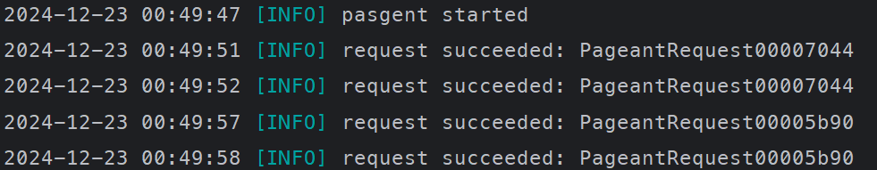

# Pasgent

Pasgent is a tool used to simulate Pageant on Windows, utilizing 1Password SSH Agent for SSH authentication.

Pasgent registers the Pageant Window Message Class `Pageant` and forwards ssh-agent requests to the 1Password SSH Agent's Named Pipe `\\.\pipe\openssh-ssh-agent` to implement the authentication simulation process.

**Please note that this tool cannot run simultaneously with Pageant.**

## :gear: How to use

Download the release and then run it.

